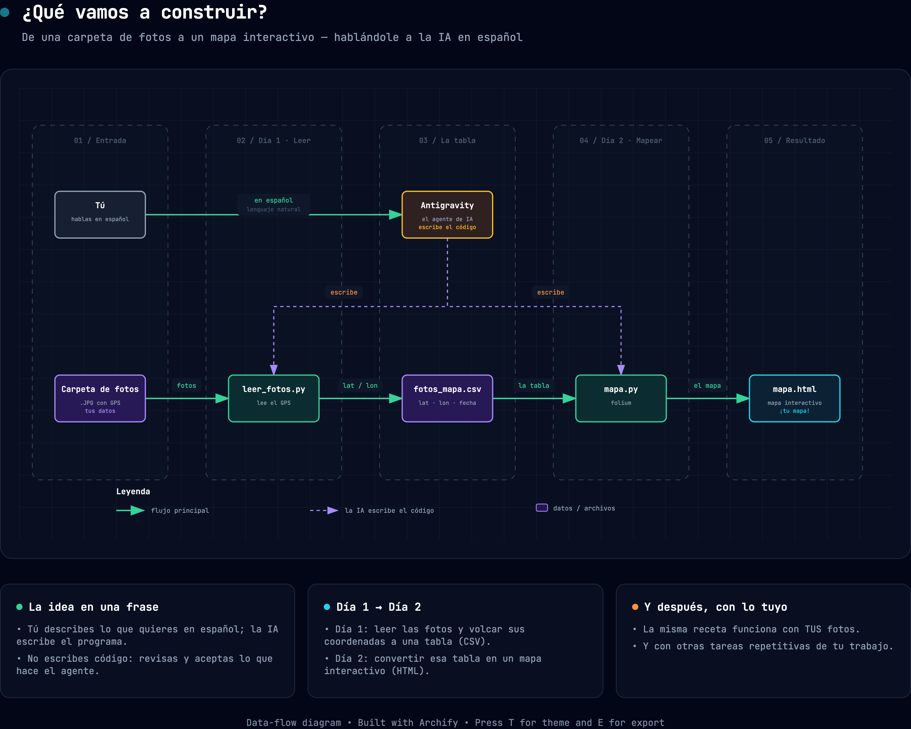

# Taller: Usar IA con lenguaje natural para desarrollar software en Geografía

**Universidad de Sevilla · Cátedra de IA US-Google · Cactus Accelerative Innovation**
📅 29 y 30 de junio de 2026 · 🕔 17:00 · Facultad de Geografía e Historia

---

## ¿Qué vas a construir?

Una herramienta que **lee una carpeta de fotos de campo y las coloca en un mapa interactivo**, leyendo automáticamente las coordenadas GPS de cada foto.

Y lo importante: **no vas a escribir ni una sola línea de código**. Le vas a
*hablar en español* a un asistente de IA (Google Antigravity) y él escribe el
programa por ti. Al final podrás hacerlo con **tus propias fotos**.

> El objetivo no es que te conviertas en programador/a, sino que salgas de aquí
> capaz de resolver tareas repetitivas de tu trabajo con la ayuda de la IA.

**El plan de un vistazo:**



> 🖼️ Versión interactiva (tema claro/oscuro, exportable):
> [`guia/que-vamos-a-construir.html`](guia/que-vamos-a-construir.html).
> Versión clara para proyector: `guia/que-vamos-a-construir-claro.png`.

## El plan de los dos días

| Día | Construimos | Resultado |
|-----|-------------|-----------|
| **29 jun — Día 1** | `leer_fotos.py` | Una tabla `fotos_mapa.csv` con el nombre, las coordenadas y la fecha de cada foto |
| **30 jun — Día 2** | `mapa.py` | Un mapa interactivo `mapa.html` con cada foto en su sitio — primero con las fotos de ejemplo, luego **con las tuyas** |

## Cómo empezar (3 pasos)

1. **ANTES del taller** → lee y completa **[`00-ANTES-DEL-TALLER.md`](00-ANTES-DEL-TALLER.md)**. Es obligatorio: si llegas sin esto hecho, perderás tiempo.
2. **En el taller** → abre *esta carpeta* en Google Antigravity.
3. **Sigue los prompts** → [`prompts/dia-1-prompts.md`](prompts/dia-1-prompts.md) el primer día y [`prompts/dia-2-prompts.md`](prompts/dia-2-prompts.md) el segundo. Cópialos y pégalos en el asistente.

## Qué hay en este repositorio

```
taller-geo-ia/
├── 00-ANTES-DEL-TALLER.md     ← EMPIEZA AQUÍ (instalación previa)
├── AGENTS.md                  ← reglas que el asistente (Antigravity) lee solo
├── fotos_ejemplo/             ← 18 fotos de campo geolocalizadas (Alicante)
├── prompts/
│   ├── dia-1-prompts.md       ← prompts del Día 1 (fotos → tabla)
│   └── dia-2-prompts.md       ← prompts del Día 2 (tabla → mapa → tus fotos)
├── guia/
│   ├── que-vamos-a-construir.html  ← diagrama: el plan de un vistazo
│   ├── que-puedes-construir.html   ← cierre: "¿y si...?" — lo que ya puedes hacer
│   └── chuleta-conceptos.md        ← resumen para llevarte: prompts, contexto, agentes
├── scripts/
│   └── preparar_datos.py      ← (uso interno) cómo se prepararon las fotos
└── requirements.txt           ← librerías que usa el proyecto
```

## Créditos y licencia

- Materiales del taller: licencia MIT (ver [`LICENSE`](LICENSE)).
- Fotos de ejemplo: dataset CC-BY-4.0 de B. Zaragozí (2020). Ver [`ATRIBUCION-DATOS.md`](ATRIBUCION-DATOS.md).
