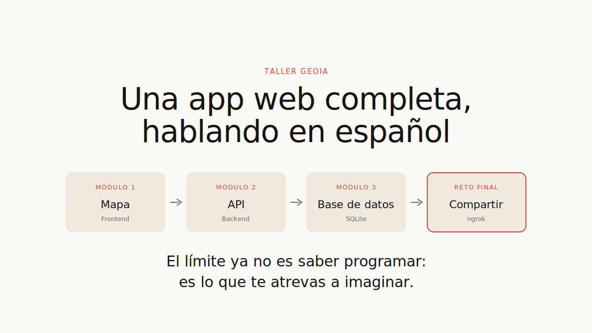

# Construye tu primera app web hablando en español

**Universidad de Sevilla · Cátedra de IA US-Google · Cactus Accelerative Innovation**
29 y 30 de junio de 2026 · 17:00 · Facultad de Geografía e Historia

---

## ¿Qué vas a construir? — **GEOIA**

**GEOIA** (de *Geo* + *IA*), una **app web de verdad**: un **mapa interactivo** con
lugares marcados que, poco a poco, aprende a **guardar** los tuyos. Y lo importante:
**no vas a escribir ni una sola línea de código.** Le hablas en español a un asistente
de IA (**Google Antigravity**) y él lo programa por ti. Tú **diriges, miras y decides.**

> El objetivo no es que te conviertas en programador/a. Es que salgas con otra
> cabeza: **si se me ocurre algo, lo puedo prototipar.** El límite ya no es saber
> programar; es lo que te atrevas a imaginar.
> **Imagínalo → pídeselo → inténtalo.**

## El plan del taller

**GEOIA** se construye por piezas, una por módulo:

- **Día 1 — El mapa** (`modulo-1-mapa/`): un mapa en el navegador con los lugares
  marcados; pulsas uno y ves su nombre y su descripción. Su guía trae el prompt listo
  para pegar.
- **Día 2 — El servidor y la memoria** (`modulo-2-servidor/`, `modulo-3-memoria/`):
  el motor que sirve los datos y la base de datos que los recuerda; y al final,
  **compartes tu app** con un enlace.

> ¿Quieres el **mapa completo del viaje** (qué construyes cada día y cómo sabrás que va
> bien)? Está en **[`guia/hoja-de-ruta.md`](guia/hoja-de-ruta.md)**. El Día 1 montas el
> mapa; lo demás lo descubrimos en directo.
>
> *(Por curiosidad: el mapa usa una librería llamada Leaflet. No necesitas saber qué
> es: el agente se encarga.)*

## Cómo empezar (3 pasos)

1. **Antes del taller** → lee **[`INSTRUCCIONES.md`](INSTRUCCIONES.md)** e instala los
   requisitos (el agente de IA, `uv`). Son 15–20 minutos. (Si te atascas, no pasa nada:
   abrimos la sala a las 16:30 para echarte una mano.)
2. **En el taller** → abre tu **agente de IA** (Antigravity u OpenCode) y carga esta
   carpeta `taller-geo-ia` (arrástrala a la ventana o usa su botón de abrir carpeta).
3. **Sigue la guía** → abre **[`modulo-1-mapa/`](modulo-1-mapa/README.md)**: trae el
   prompt para copiar y pegar y cómo saber que va bien.

> ¿Es tu primera vez con un agente? Suéltate con el calentamiento opcional
> `prompts/dia1-calentamiento.txt` (una página web sencilla para perderle el miedo)
> antes de ir al mapa.

> ¿Te pierde alguna palabra (mapa, marcador, prompt…)? Tienes una
> **chuleta** de bolsillo en **[`guia/chuleta-conceptos.md`](guia/chuleta-conceptos.md)**
> y todos los prompts juntos en **[`guia/prompts.md`](guia/prompts.md)**.

> ¿Quieres ver **el viaje completo** (qué construyes cada día y cómo sabrás que va
> bien)? Tienes la **hoja de ruta** en
> **[`guia/hoja-de-ruta.md`](guia/hoja-de-ruta.md)**.

## Los datos del mapa

Para no empezar con un mapa vacío, viene **sembrado con 18 lugares reales**: puntos de
trabajo de campo en la **Marina Baja (Alicante)**. Las coordenadas salen del GPS de
fotos reales. Mira **[`datos/README.md`](datos/README.md)**. No tienes que tocarlos:
el agente los usa por ti.

## Qué hay en esta carpeta

- **`INSTRUCCIONES.md`** — empieza aquí (requisitos, pasos y retos, todo junto).
- **`modulo-1-mapa/`** — Día 1: el mapa.
- **`datos/`** — los 18 lugares de ejemplo.
- **`fotos_ejemplo/`** — las fotos de esos lugares.
- **`prompts/`** — los prompts listos para copiar y pegar (un `.txt` por paso).
- **`guia/`** — la chuleta de conceptos, la guía y la **hoja de ruta** del taller.
- **`ejemplo-terminado/`** — un mapa de ejemplo con los retos del Módulo 1 ya hechos.
- **`presentacion/`** — la presentación del taller para repasarla a tu ritmo.

> El **Día 2** crearás dos carpetas más hablando con el agente: `modulo-2-servidor/`
> (el servidor) y `modulo-3-memoria/` (la base de datos). Aún no están: las montas tú.

---

Las fotos y coordenadas de ejemplo son de **B. Zaragozí (Alicante)** —
gracias por compartirlas. Los materiales del taller son de uso libre. Los detalles
están en [`ATRIBUCION-DATOS.md`](ATRIBUCION-DATOS.md).
